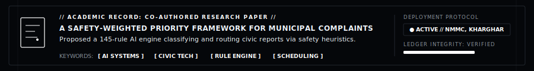
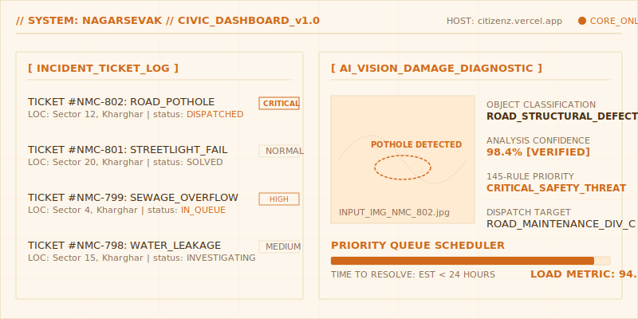
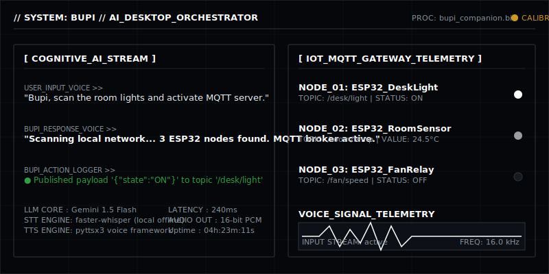
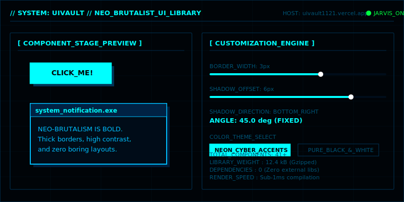
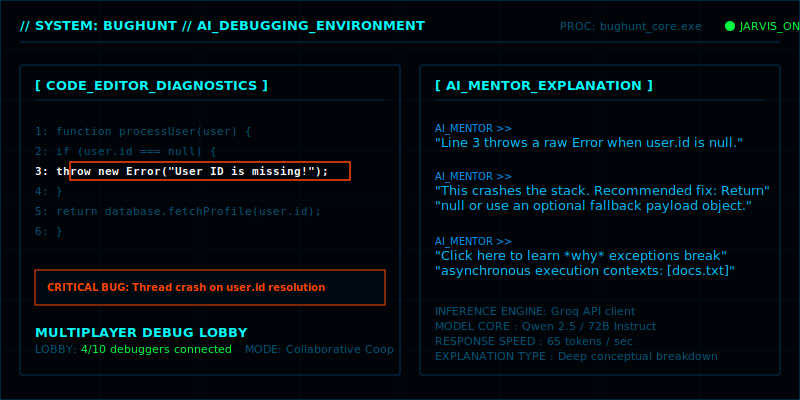

<div align="center">


<br/>

<a href="mailto:Sachinyadav402107@gmail.com">
  
</a>
<a href="https://github.com/bunnybot1121">
  
</a>
<a href="https://sachin-0.vercel.app">
  
</a>
<a href="https://uivault1121.vercel.app">
  
</a>

<br/><br/>


&nbsp;


</div>

<br/>

---

## `$ whoami`

<table>
<tr>
<td width="52%">

```yaml
# sachin.config.yml

identity:
  name     : "Sachin Yadav"
  role     : "Full-Stack AI Developer"
  year     : "2nd Year — Computer Engineering"
  college  : "Saraswati College of Engineering"
  location : "Kharghar, Navi Mumbai 🇮🇳"

focus:
  - AI Integration & Civic Tech
  - Full-Stack Web Development
  - IoT & Embedded Systems (ESP32)
  - Research & Open Source

currently_building:
  - NagarSevak   # AI municipal platform
  - Bupi         # Desktop AI companion
  - UIVault      # Bold Neo-brutalist UI

research:
  - "145-Rule Safety-Weighted AI Priority
     Framework for Municipal Complaints"
```

</td>
<td width="48%" align="center">


</td>
</tr>
</table>

---

## `$ cat research.txt`

<p align="center">
  
</p>

---

## `$ ls ./projects`

#### 🏙️ &nbsp;[NagarSevak](https://citizenz.vercel.app)
AI-powered municipal complaint and scheduling platform designed for NMMC/Kharghar.
*   **Key Features:** 145-rule safety-weighted priority scheduler · Automated Gemini Vision damage classification.
*   **Architecture:** Three role-separated portals for citizens, field workers, and municipal admins.
*   **Stack:** `React` · `Supabase` · `Gemini API` · `Vercel`
*   **Portals:** [Citizen Portal](https://citizenz.vercel.app) &nbsp;·&nbsp; [Admin Portal](https://rnmunicipal.vercel.app) &nbsp;·&nbsp; [Worker Portal](https://fieldstaff.vercel.app)

<p align="center">
  
</p>

<br/>

#### 🤖 &nbsp;[Bupi — AI Companion](https://github.com/bunnybot1121)
Dual-mode system serving as a desktop AI companion and an IoT/robotics device orchestrator.
*   **Key Features:** `faster-whisper` STT · `pyttsx3` TTS · Gemini 1.5 Flash assistant model.
*   **IoT System:** EventBus asynchronous event routing with ESP32 device control over MQTT.
*   **Stack:** `Python` · `PyQt6` · `MQTT` · `ESP32`
*   **Repository:** [View Codebase](https://github.com/bunnybot1121)

<p align="center">
  
</p>

<br/>

#### 🎨 &nbsp;[UIVault](https://uivault1121.vercel.app)
A bold, expressive, and production-ready neo-brutalist UI component library.
*   **Key Features:** 41+ unique components designed to escape boring/generic web layouts.
*   **Design:** High-performance, dependency-free vanilla implementations.
*   **Stack:** `HTML5` · `CSS3` · `Vanilla JavaScript`
*   **Links:** [Live Library](https://uivault1121.vercel.app) &nbsp;·&nbsp; [View Codebase](https://github.com/bunnybot1121)

<p align="center">
  
</p>

<br/>

#### 🐛 &nbsp;[BugHunt](https://github.com/bunnybot1121)
Interactive AI coding mentor that explains the mechanics of bugs alongside multiplayer debugging.
*   **Key Features:** "Among Us"-style collaborative debugging lobby · Automated tutor explains *why* code failed.
*   **AI Engine:** Groq API using Qwen 2.5/72B for high-speed, accurate code inference.
*   **Stack:** `React` · `Node.js` · `Express` · `Groq`
*   **Repository:** [View Codebase](https://github.com/bunnybot1121)

<p align="center">
  
</p>

---

## `$ cat stack.sh`

```bash
#!/bin/bash

# Frontend Stack
frontend=("HTML5" "CSS3" "JavaScript" "React" "React Native" "Vite" "Three.js")

# Backend & Database
backend_db=("Node.js" "Express" "Python" "Supabase" "PostgreSQL")

# AI & Embedded
ai_embedded=("Gemini API" "TensorFlow Lite" "PyQt6" "ESP32" "MQTT")

# Tools & DevOps
tools_devops=("Git" "GitHub Actions" "Vercel" "VS Code" "Figma")
```

<div align="center">
  
  
  
  
</div>

---

## `$ git log --stat`

<div align="center">


&nbsp;&nbsp;


<br/><br/>


<br/>

<picture>
  <source media="(prefers-color-scheme: dark)" srcset="https://raw.githubusercontent.com/bunnybot1121/bunnybot1121/output/github-snake-dark.svg" />
  <source media="(prefers-color-scheme: light)" srcset="https://raw.githubusercontent.com/bunnybot1121/bunnybot1121/output/github-snake.svg" />
  
</picture>

</div>

---

## `$ tail -f activity.log`

<!--START_SECTION:activity-->
1. 🎉 Merged PR [#7](https://github.com/piyushyenorkar/NHAIFaceID/pull/7) in [piyushyenorkar/NHAIFaceID](https://github.com/piyushyenorkar/NHAIFaceID)
2. 💪 Opened PR [#7](https://github.com/piyushyenorkar/NHAIFaceID/pull/7) in [piyushyenorkar/NHAIFaceID](https://github.com/piyushyenorkar/NHAIFaceID)
3. 🎉 Merged PR [#6](https://github.com/piyushyenorkar/NHAIFaceID/pull/6) in [piyushyenorkar/NHAIFaceID](https://github.com/piyushyenorkar/NHAIFaceID)
4. 🗣 Commented on [#6](https://github.com/piyushyenorkar/NHAIFaceID/pull/6#issuecomment-4614160122) in [piyushyenorkar/NHAIFaceID](https://github.com/piyushyenorkar/NHAIFaceID)
<!--END_SECTION:activity-->

---

<div align="center">
  <sub>Built with obsession · Shipped with purpose · Powered by chai ☕</sub>
</div>


