 

 

---

### ⚡ STARK INDUSTRIES TERMINAL

| FIELD | DATA |
|---|---|
| AGENT | Sachin Yadav |
| ALIAS | bunnybot1121 |
| CLEARANCE | Level 7 — DEVELOPER 🔴 |
| LOCATION | India 🇮🇳 |
| ARC CORE | 100 Ideas OVERCLOCKED 🔥 |
| DIRECTIVE | Build. Break. Improve. Repeat. |
| STATUS | ██████████████░░ BUILDING |

 

---

## ⚡ JARVIS — MISSION LOG

| PROTOCOL | STATUS | PRIORITY |
|---|---|---|
| 🔨 Mastering HTML & CSS | `IN PROGRESS` | 🔴 CRITICAL |
| 🧠 Learning JavaScript | `QUEUED` | 🟠 HIGH |
| 🚀 Build a full website | `IN PROGRESS` | 🔴 CRITICAL |
| 🌍 Make something the world uses | `PLANNED` | 🟡 MEDIUM |
| 🦾 Become the Tony Stark of code | `LIFETIME GOAL` | ⚡ INFINITE |

---

## 🔩 TECH MODULES LOADED

---

## 📡 RUNNING DIAGNOSTICS

---

## 📊 METRICS

---

## ⚡ RECENT ACTIVITY
<!--START_SECTION:activity-->
<!--END_SECTION:activity-->

---

## ⏱️ CODING STATS
<!--START_SECTION:waka-->
<!--END_SECTION:waka-->

---

## 🕸️ CONTRIBUTION WEB

<picture>
  <source media="(prefers-color-scheme: dark)" srcset="https://raw.githubusercontent.com/bunnybot1121/bunnybot1121/output/github-contribution-grid-snake-dark.svg"/>
  
</picture>

---

## 🎬 THE AVENGERS TEST

| | |
|---|---|
| **STARK** | "Kid, you write HTML?" |
| **SACHIN** | "Yes sir." |
| **STARK** | "CSS too?" |
| **SACHIN** | "Yes sir." |
| **STARK** | "Ideas?" |
| **SACHIN** | "A hundred of them." |
| **STARK** | *nods* "You're in." |
| **PARKER** | "That's literally how I got recruited too." |

---

> ### *"Tony built his first suit in a cave.*
> ### *Peter stopped a bus with his bare hands.*
> ### *I'm just getting started — but I've got the same fire."*
> **— Sachin Yadav 🦾🕷️**

